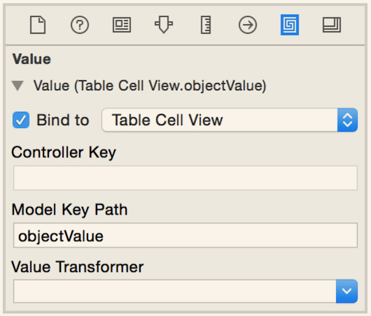

# TableView's Delegate and DataSource

A table view can have two helper objects: a delegate and a data source.

- **NSTableViewDelegate**
Responds to user interaction with the table view.
- **NSTableViewDataSource**
Supplies the table view with the data it should display.

Typically, a single object plays both roles.
 
# NSTableViewDataSource
The data source waits on the table view to ask for data. The data source is the table view’s **helper** rather than its boss.

The table view asks for its data one piece at a time (i.e., a single object to display at a specific row and column combination) rather than all at once.

The conversation between a table view and its data source consists mainly of the table view asking **two questions**.

1. The first question is asked once at the beginning: “How many rows are there in the data set?” 
Answered by:

    `func numberOfRowsInTableView(tableView: NSTableView) -> Int`

2. The second question is asked repeatedly and as necessary: “May I have the data for row X and column Y?” 

    `func tableView(tableView: NSTableView,
                    objectValueForTableColumn tableColumn: NSTableColumn?,
                    row: Int) -> AnyObject?`

# Tables, Cells, and Views

## Table cell views

A table cell view can be as simple or complex as your application needs. Each column in your table has a table cell view of a particular type. 

Interface Builder’s object library offers two types of table cell view:

- Text Table Cell View, contains a single text field
- Image & Text Table Cell View, contains a text field and an image view

You can also create custom table cell views.

## Workflow to Get Data from DataSource and Display in TableView

- When the table view asks for data to display in a particular cell, the data source returns an **object**.
- The table view sets this object to the **objectValue of the table cell view**.
- **Note**: Setting the objectValue of the table cell view will not affect what the table actually displays. The table displays the value of the text field (or other control) of the table cell view. This means you must do a little more work to ensure that the value of the text field is updated when the objectValue of the table cell view is set. Could do it using Cocoa bindings.
- **Bind** the **value** of each text field to the **objectValue of its table cell view**.
