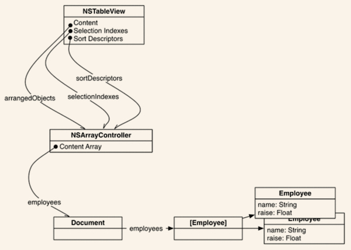
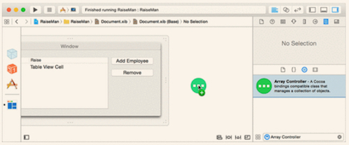
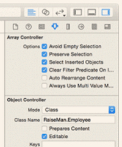
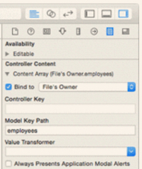
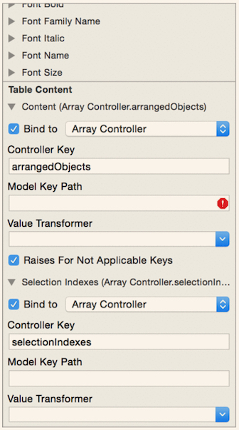

# Introducing NSArrayController

NSArrayController, like any controller, serves as the glue between a view and its model, an array of objects. 

Use bindings to 

- Connect the table view to the array controller
- Connect the array controller to the model

The two most important properties on NSArrayController are content and arrangedObjects. 

## NSArrayController.content

Could consider **NSArrayController.content** as the **input** to the array controller.

Almost never use the content property, however. Instead, frequently use its binding name, **Content Array**, to bind to a model array. 

## NSArrayController.arrangedObjects

Could consider **NSArrayController.arrangedObjects** as the **ouput** to the array controller.

For example, a table view’s Content would be bound to the array controller’s arrangedObjects.

**Why is it called “arranged objects”?**

NSArrayController not directly send the data from model level to view level, but transform between them. So, if the input is *object*, the output is *arranged objects*.

The transforms include filtering, sorting, matching the indexes, etc.

## Adding an Array Controller to XIB

**Set class for the array controller**

Select the Array Controller, go to the attributes inspector. Locate the Object Controller section. Set the Class Name (here it's RaiseMan.Employee).

## Binding the Array Controller to the Data Model

- Select the array controller
- Go to the bindings inspector
- Find the Content Array binding and expand it
- Select File's Owner in the pop-up next to Bind to and check the box
- Leave the Controller Key blank and enter employees for the Model Key Path. 

Could understand as binding the Content Array of the array controller to the employees array of File's Owner.

Note: 

- Arrange operations (e.g., filtering, sorting, etc) by Array Controller will **NOT** affect the content array.
- Edit operations (e.g., adding, removing, etc) **Will** affect the content array.

## Binding the Table View’s Content to the Array Controller

- Select the table view. 
- Switch to the bindings inspector and find the Table Content section. 
- Bind the table view’s Content to the Array Controller’s arrangedObjects. 
- Leave the Model Key Path empty. Ignore the red error indicator at the right-hand side of the Model Key Path field.

# Notes

## NSDocument

In a document-based application, a subclass of NSDocument is used to control the window or windows used to display a single document. 

Often, this means that an NSDocument acts much as a window controller does: An NSDocument has a reference to the data that makes up the document, and it manages shuttling that data to the views in the window it manages.

## Data Model Class Inherit to NSObject

`class Employee : NSObject {}`

Have to declare Employee to be a subclass of NSObject. This is necessary in order for the class to play nice with the bindings.
