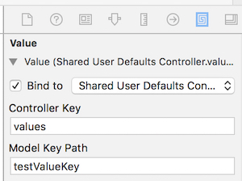

#NSUserDefaults
The NSUserDefaults class is your interface to the user’s defaults database. With it you can register factory defaults, set the user’s defaults, and read the defaults back out as needed.
#Operations
##Shared defaults
```swift
class func standardUserDefaults() -> NSUserDefaults
```
##Registering defaults
```swift
func registerDefaults(registrationDictionary: [NSObject : AnyObject])
```
Your application can register a set of defaults “from the factory.” These are the defaults that your application uses when users have not made their own configuration selections. 

The contents of the registration domain are **not** written to disk; you need to call this method each time your application starts. You can place a plist file in the application's Resources directory and call registerDefaults: with the contents that you read in from that file.
##Setting defaults
```swift
func setBool(value: Bool, forKey defaultName: String)
func setFloat(value: Float, forKey defaultName: String)
func setInteger(value: Int, forKey defaultName: String)
func setObject(value: AnyObject?, forKey defaultName: String)
```
##Reading defaults
```swift
func boolForKey(defaultName: String) -> Bool
func floatForKey(defaultName: String) -> Float
func integerForKey(defaultName: String) -> Int
func objectForKey(defaultName: String) -> AnyObject?
```
##Removing defaults
```swift
func removeObjectForKey(defaultName: String)
```
Removes the value for the defaultName default. The application will return to using the value given by the factory defaults or elsewhere.
#Best Practice: Use a Wrapper Class
Rather than using NSUserDefaults directly to configure SpeakLine’s user interface and store the user’s defaults from within AppDelegate, you will write a PreferenceManager wrapper class. This class will make use of NSUserDefaults to persist preferences.

```swift
import Cocoa

class PreferenceManager {
  let userDefaults = NSUserDefaults.standardUserDefaults()
  
  private let speakTextKey = "Speak Text"  
  let defaultSpeakText = ""
  
  var speakText: String {
    get {
      return (userDefaults.objectForKey(speakTextKey) as? String) ?? defaultSpeakText
    }    
    set {
      userDefaults.setObject(newValue, forKey: speakTextKey)
    }
  }
    
  init() {
    registerFactoryDefaults()
  }
  
  func registerFactoryDefaults() {
    let factoryDefaults = [
      speakTextKey: defaultSpeakText
    ]
    
    userDefaults.registerDefaults(factoryDefaults)
  }
  
  func resetFactoryDefaults() {
    userDefaults.removeObjectForKey(speakTextKey)
  }
  
  func synchronize() {
    userDefaults.synchronize()
  }
}
```
Other tips
* Create a class instance when uses the wrapper class.
* Save new values before app quits. Remember to **synchronize** it to write to disk immediately.

#What Can Be Stored in NSUserDefaults?
The NSUserDefaults class provides convenience methods for accessing common types such as **floats, doubles, integers, Booleans, and URLs**.
A default object must be a property list, that is, an instance of (or for collections a combination of instances of): **NSData, NSString, NSNumber, NSDate, NSArray, or NSDictionary**.
If you want to store any other type of object, you should typically archive it to create an instance of NSData. For more details, see Preferences and Settings Programming Guide.
#Where is the User’s Defaults Database?
For non-sandboxed app:
```sh
~/Library/Preferences/com.example.myapp.plist
~/Library/SyncedPreferences/com.example.myapp.plist
```
For sandboxed app:
```sh
~/Library/Containers/com.example.myapp/Data/Library/Preferences/com.example.myapp.plist
~/Library/Containers/com.example.myapp/Data/Library/SyncedPreferences/com.example.myapp.plist
```
#Reading/Writing Defaults from the Command Line
E.g.,
```sh
defaults read com.apple.dt.Xcode
```
#NSUserDefaultsController
An NSUserDefaultsController could be used to bind to a value from the NSUserDefaults object to UI values. All the NIBs in your application will use a single shared instance of NSUserDefaultsController.
For example, if you wanted to use bindings to deal with SpeakLine’s text field, you would bind it to the shared NSUserDefaultsController with a Controller Key of values and a Model Key Path of activeTextKey.


#How much data can reasonably store in NSUserDefaults
No, there is no size limit to NSUserDefaults, aside from the storage capacity of the device itself.
But don't frequently query it as it may need to read or write disk (OS may cache it).
