This article records the detailed steps to add localizations for a project.

Development environment:
* OS X: 10.11.4
* XCode: 7.3
* Swift: 2.2

#Auto Layout and Double-Length Pseudolanguage
For localized app, typically you need to set the UI to '**Auto Layout**'. As the same string in different languages may have very different length, the 'auto layout' could let each language corecttly display.

How to test the auto layout correclty work or not? Beside really test the app with different language, you can also use '**Double-Length Pseudolanguage**'. This localization simply takes the text of your development language, and doubles it. So, for example, “Tell the World” becomes “Tell the World Tell the World.” While many pieces of text won’t actually double in length when translated to another langauge, it serves as a great way to test to see whether your interface can handle the wide variation in length.

Steps to preview a localization in Interface Builder:
* In project navigator, select the `.storyboard` or `.xib` file you want to preview.
* Choose View > Assistant Editor > Show Assistant Editor.
* In the assistant editor jump bar, open the Assistant pop-up menu, scroll to and choose the Preview item, and choose the `.storyboard` or `.xib` file from the submenu.
If a preview of the app’s user interface doesn’t appear in the assistant editor, select the window or view you want to preview in the icon or outline view.

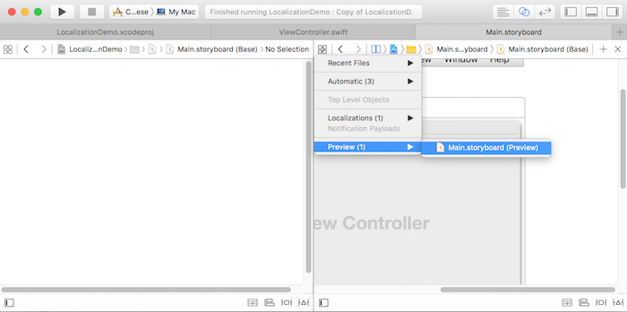

* In the assistant editor, choose the localization you want to preview from the language pop-up menu in the lower-right corner.

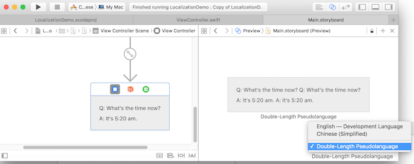

Now, a preview of the localization appears in the assistant editor. If you choose a real language, strings that do not need to be localized or need to be localized, but currently are not, appear in uppercase.

#Use Localized String in Code
The key is to use `NSLocalizedString` function. It could load localized text from the localized string file.

To explicit ordering of tokens in format strings, could use `%1$@`, `%2$@`, etc.

The related code is:

```swift
  func setLabelStrings() {
    let dateFormatter = NSDateFormatter()
    dateFormatter.dateStyle = .NoStyle
    dateFormatter.timeStyle = .ShortStyle
    let dateString = dateFormatter.stringFromDate(NSDate())
    
    question = NSLocalizedString("Q: What's the time now?", comment: "Question")
    answer = String(format: NSLocalizedString("A: It's %@.", comment: "Answer"), dateString)
  }
```

#Add Localization Language for Project
Add a new localization to the project could make Xcode aware that you want to start translating files into that language, which means you can do things like select that language in the Preview assistant.
* Select the project in the project navigator. 
Note: It's **PROJECT**, but not targets.
* Add the new localization.
Scroll down to the Localizations section. Click the + button, and select 'Chinese (Simplified)' from the menu that appears

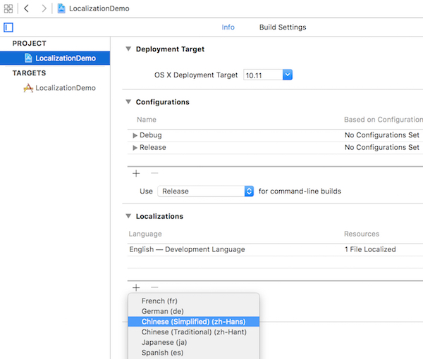

* Select the files you want to localize.
Xcode will ask you which files you want to translate into the new language. At this stage, there will only be a single file: the app’s interface, stored in MainMenu.xib. It’s selected by default, so click Finish.
Note: select "Locializable Strings", but not 'Interface Builder Story'.

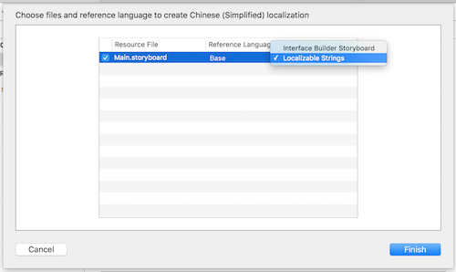

* A new file will be created: a strings file for the storyboard file. It’ll appear as an item inside the storyboard file, in the project navigator.

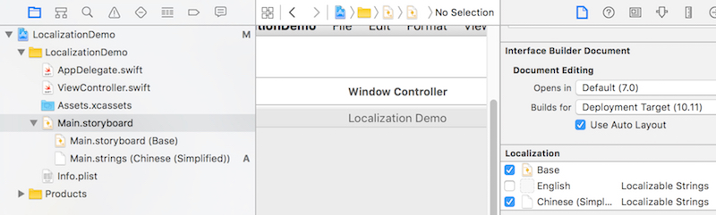


#Add Localizations Files

To well organize the localized strings, it's better we manually add 2 string files here: '**Localizable.strings**' and '**InfoPlist.strings**'. 'Localizable.strings' will store the strings in app. For 'InfoPlist.strings', please check the following introduction.

##Localizing Property List Values
The values for many keys in an information property list file are human-readable strings that are displayed to the user by the Finder or your own app. When you localize your app, you should be sure to localize the values for these strings in addition to the rest of your app’s content.

Localized values are not stored in the Info.plist file itself. Instead, you store the values for a particular localization in a strings file with the name '**InfoPlist.strings**'. You place this file in the same language-specific project directory that you use to store other resources for the same localization. The contents of the InfoPlist.strings file are the individual keys you want localized and the appropriately translated value. The routines that look up key values in the Info.plist file take the user’s language preferences into account and return the localized version of the key (from the appropriate InfoPlist.strings file) when one exists. If a localized version of a key does not exist, the routines return the value stored in the Info.plist file.

##Add 'Localizable.strings' and 'InfoPlist.strings'
Before add the strings files, it's better to add a 'Localizations' group in project. And it's also better to create the corresponding folder in Finder.

Now it's time really add the string files.
* Create a new file in the project: a strings file. You’ll find this in the Resource section of the file templates. Name the file as 'Localizable.strings', save in the 'Localizations' folder.

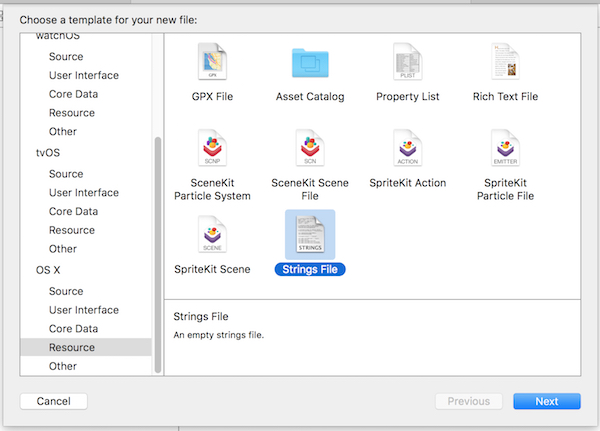

* Select the 'Localizable.strings' file. Open the 'File Inspector' and scroll down to Localizations.
Click the Localize button. A menu will appear; choose Base and click Localize.

Now the localization option has changed, with three small checkboxes, one for Base, one for English, and the last for Chinese Simplified. Select Base and Chinese Simplified. In fact the Base is just English as we choose English as development language.

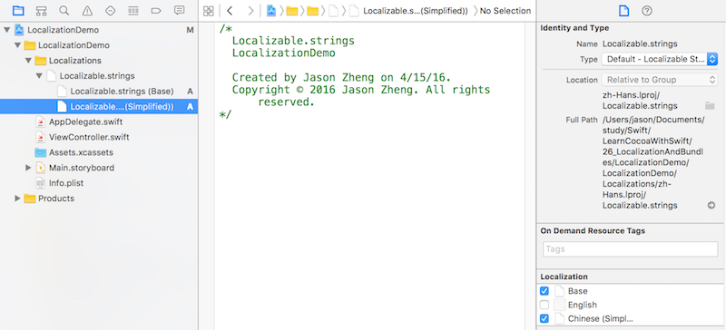


Now create 'InfoPlist.strings' and did same settings as 'Localizable.strings'. The difference is, save the 'InfoPlist.strings' in same level of 'Localizations' in Finder, but still in the 'Localizations' group in project. After set it as localization, it will auto matically be moved to 'Base.lproj' and 'zh-Hans.lproj' in Finder.

How to localize the app's name displayed with app icon in Finder? add this string in Base version of 'InfoPlist.strings':
```swift
/* App Name */
CFBundleDisplayName ="Localization Demo";
```
And add this for the Chinese Simplified version:
```swift
/* App Name */
CFBundleDisplayName ="本地化示例";
```

**NOTE**
It’s important to use the file names of 'InfoPlist.strings' and 'Localizable.strings', as the app will look for the files with these names.


After added, the files in Finder will looks like:

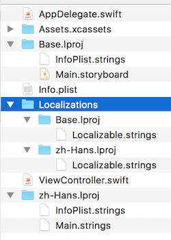


#Edit Localization Files
There're 2 ways to edit the localization files: Direclty Edit and Using .xliff Files. Now let's introduce the .xliff files.

Normally, you don't translate the app by yourself, but let some others who are expert for the language to do it. How to cooperate with them? Use .xliff file.

##Export .xliff Files
* Select the root of the project.
* Select 'Editor' menu > 'Export for localization...'. In the popup dialog, select where to store the files. Need to select 'Chinese (Simplied)' in languages. This means export the .xliff file for the languages selected. Click 'Save'.
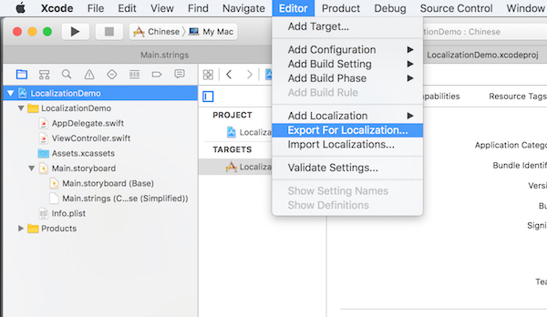
* Open the 'zh-Hans.xliff' you just saved. You can see it's like a xml file.

Edit parts for 'Localizable.strings'. Find the following part, add `<target>...</target>` under the `<source>A: It's %@.</source>`. This is just the core of 'localization'.

```xml
  <file original="LocalizationDemo/Localizable.strings" source-language="en" datatype="plaintext" target-language="zh-Hans">
    <header>
      <tool tool-id="com.apple.dt.xcode" tool-name="Xcode" tool-version="7.3" build-num="7D175"/>
    </header>
    <body>
      <trans-unit id="A: It's %@.">
        <source>A: It's %@.</source>
        <target>答：现在是 %@。</target>
        <note>Answer</note>
      </trans-unit>
      <trans-unit id="Q: What's the time now?">
        <source>Q: What's the time now?</source>
        <target>问：现在几点了？</target>
        <note>Question</note>
      </trans-unit>
    </body>
  </file>
```

##Import .xliff Files
* Select the root of the project.
* Select 'Editor' menu > 'Import localization...'. In the popup dialog, select the 'zh-Hans.xliff' you just modified. It should pop up a dialog to show the difference between the files in project and the one you just modified. Click 'Import' if it's fine.

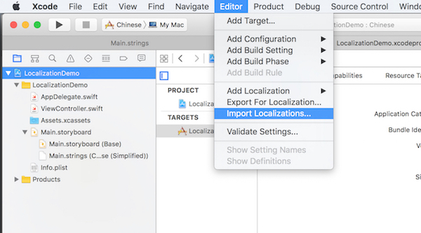

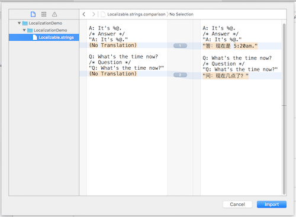

After it's done, open the 'InfoPlist.strings' or 'Localizable.strings', you should be able to say the new translated strings. Did you remember I just said there're 2 ways to edit the string files, and another one is directly edit it? Here it is, you can directly edit the files and add the strings like you added through .xliff.

#Test Localization
There're 2 ways to test the localization.

##1. Change System's Language
Open 'System Preferences' > 'Language & Region', you can drag Chinese Simplied to top of the list to activate it. You can also change the ragion.

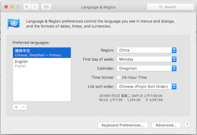

The disadvantage of this way is, you need to reboot to let the change work. And the entire system's language will be changed. How only change the language for the app? Check the following way.

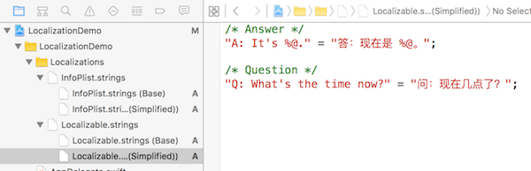


##2. Use XCode's Scheme
You can make Xcode launch the application using the special langauge or region.
To do this, you can duplicate current scheme, name it as 'Chinese (Simplified)'. Open the Options panel. Change the Application Language from System Language to 'Chinese (Simplified)'.

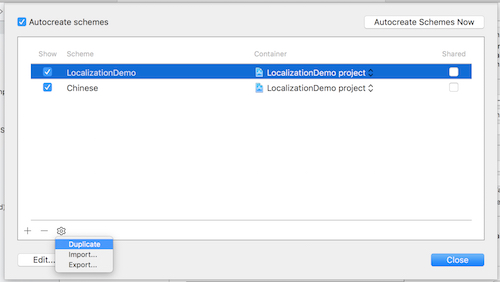

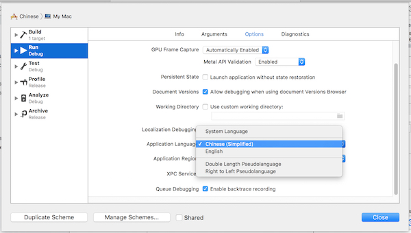

Now, run the app, it should look like:

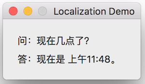