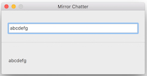
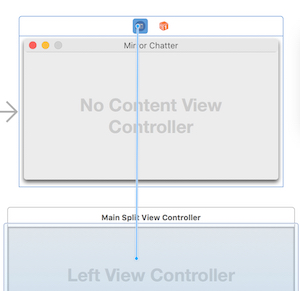
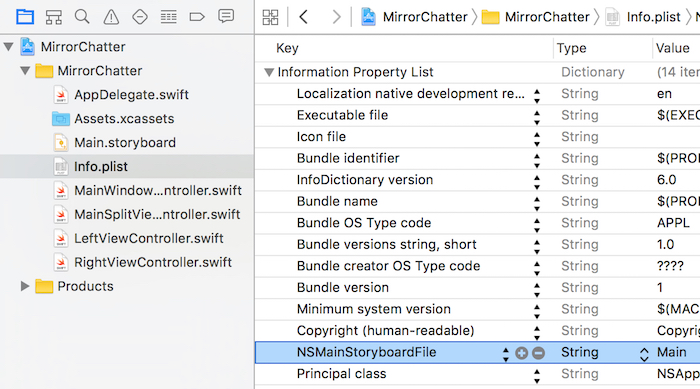
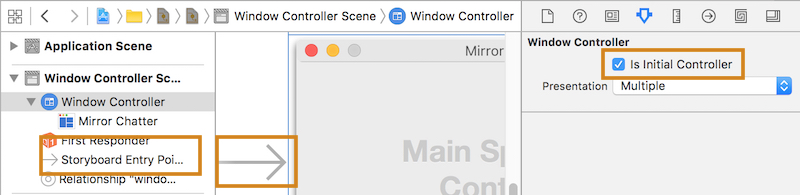

After it's finished, the app looks like:



# Storyboard introduction
With storyboards, you can combine as much (or as little) of your application as you want in one canvas, as well as visualize how the parts relate to each other.
Storyboards are organized by scenes (windows and views), which are connected to each other by segues. Segues describe the scenes’ relationships to one another. Storyboards can be used to describe a window and its popover or sheet – or a complicated graph of nested views, each with its own view controller, which previously would have necessitated programmatic construction.
Storyboards were added to OS X in 10.10 Yosemite and to iOS in version 5.

To create the relationship segue between the window controller and the split view controller, control-drag from the blue Window Controller icon in the border on top of the window controller down to the split view controller. In the pop-up Relationship Segue window that appears, select window content.



#How is the Storyboard Loaded?

Just like with MainMenu.xib, the answer is in the Info.plist.
If you check the Info.plist for this project you will see that the key NSMainStoryboardFile is set to Main.



Scenes can also be loaded from storyboards programmatically. The NSStoryboard class provides this, much like NSBundle does for NIB loading. Within a storyboard, one scene can be designated as the **initial controller**. This is used in the application’s Main.storyboard to designate the application window to be opened at launch.



Controllers within a storyboard can also be instantiated by their identifier, which is set in the identity inspector. If you had a view controller with an identifier of Palette, you could instantiate the view controller and show it in a window using the following code:
```swift
if let storyboard = NSStoryboard(name: "Main", bundle: nil) {
    if let vc = storyboard.instantiateControllerWithIdentifier("Palette")
            as? NSViewController {
        paletteWindow = NSWindow(contentViewController: vc)
        paletteWindow.makeKeyAndOrderFront(nil)
    }
}
```